# TAKKA STEEL — Warehouse Management System

A production-grade, web-based Warehouse Management System (WMS) built for **TAKKA STEEL**. The system follows a modern **decoupled architecture**: a RESTful **Node.js/Express** backend paired with a **React (Vite)** single-page application frontend. It is designed with **Clean Architecture** principles to ensure scalability, maintainability, and data integrity.

---

## 🚀 Features

### 📊 Dashboard
Real-time overview of inventory KPIs, low-stock alerts, recent transactions, and activity summaries.

### 🗂️ Master Data Management
Centralized management for:
- **Items** — products with category, unit, and supplier associations
- **Categories** — item grouping
- **Units of Measure** — packaging & measurement units
- **Suppliers** — vendor master data
- **Customers** — buyer master data

### 📦 Transaction Workflows
- **Stock In (Receiving):** Record incoming shipments with line-item detail and full audit trail.
- **Stock Out (Shipping):** Process outgoing orders and automatically adjust inventory levels.

### 📍 Stock Position & History
- **Stock Position:** Real-time per-item stock levels with search, filter, and export.
- **Stock Movement History:** Granular audit log of every stock change per item.

### 🏭 Warehouse Layout
- Interactive visual grid of the warehouse floor plan.
- **Drag-and-drop** stock placement across rack locations.
- **Manual allocation** for precise quantity management.
- View unallocated stock and move items between rack positions.

### 📈 Reports
- **Stock Report** — current inventory valuation and levels, exportable to Excel.
- **Stock In Report** — historical receiving transactions with date-range filtering.
- **Stock Out Report** — historical shipping transactions with date-range filtering.

### 🔐 User & Access Management
- Secure session-based authentication with hashed passwords (`bcryptjs`).
- **Role-Based Access Control (RBAC):**
  - `owner` — full access including user management.
  - `staff` — operational access (transactions, stock, reports).
- User profile management.

---

## 📸 Screenshots

### 🔑 Authentication & Overview
| Login Screen | Main Dashboard |
|---|---|
| 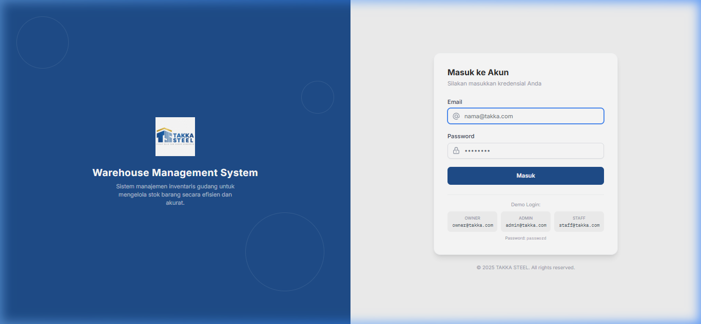 | 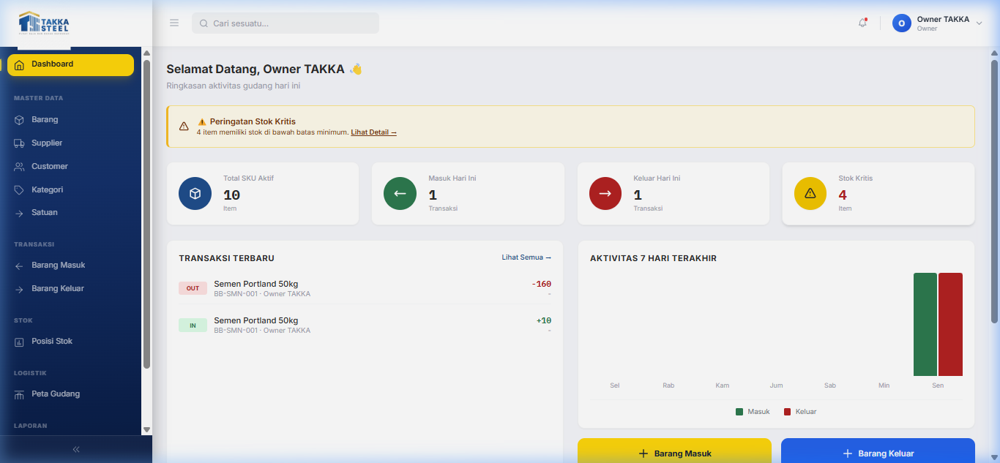 |

### 🗂️ Master Data Management
| Items List | Create/Edit Item Form | Category Management |
|---|---|---|
| 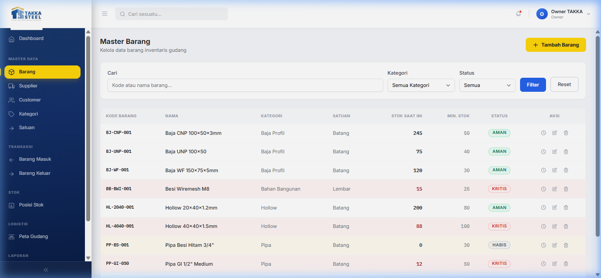 | 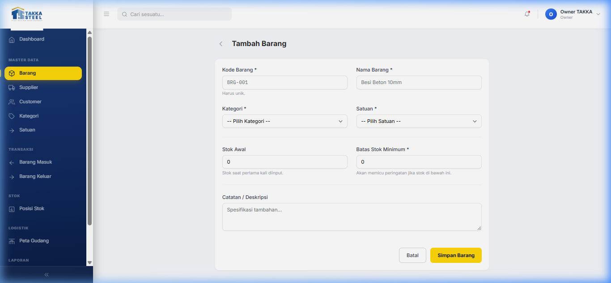 | 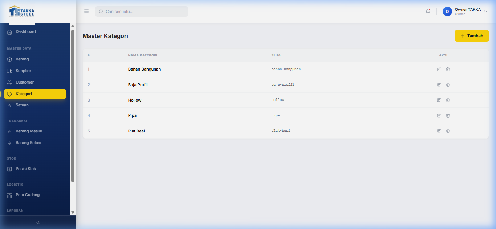 |

| Units of Measure | Supplier Management | Customer Management |
|---|---|---|
| 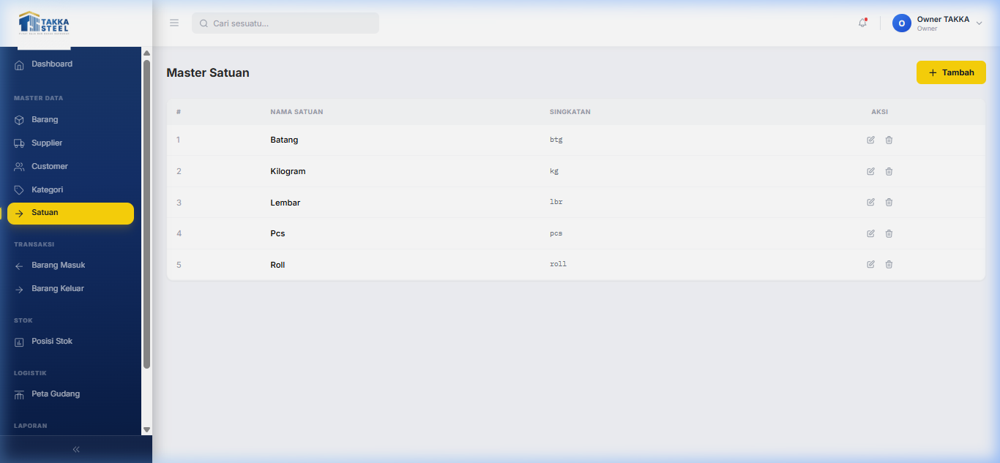 | 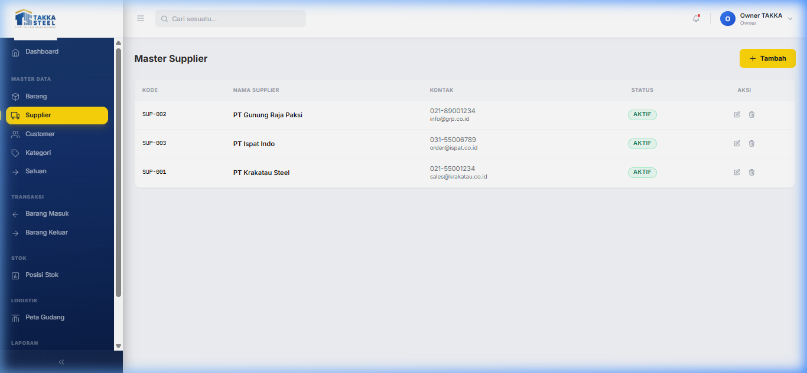 | 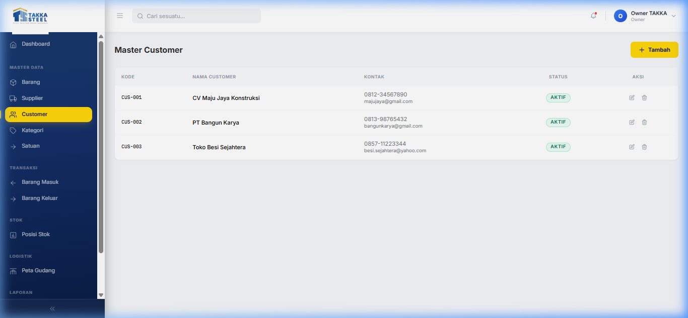 |

### 📦 Transaction Workflows (Stock In)
| Stock In List | Stock In Form | Stock In Detail |
|---|---|---|
| 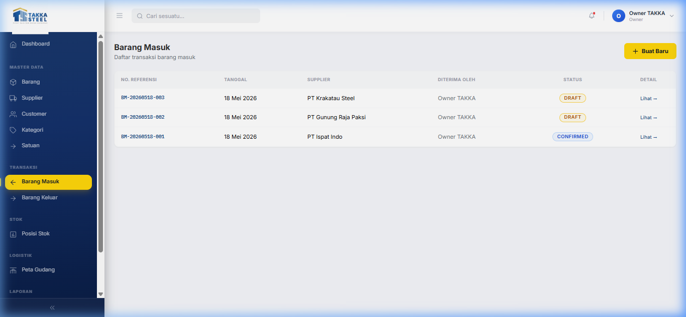 | 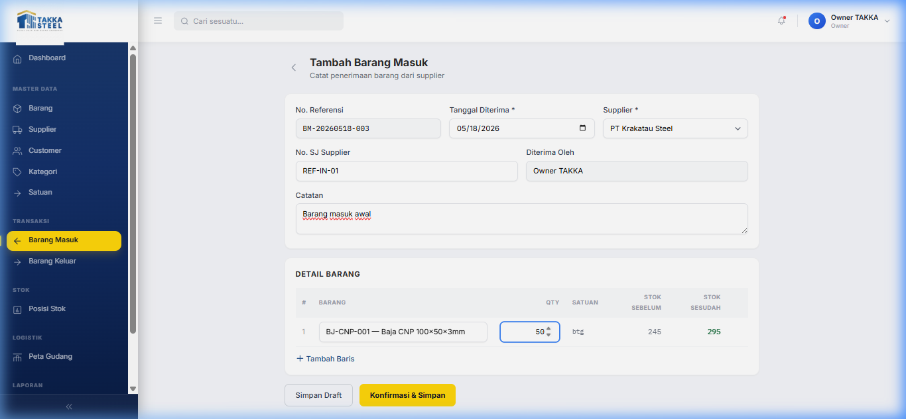 | 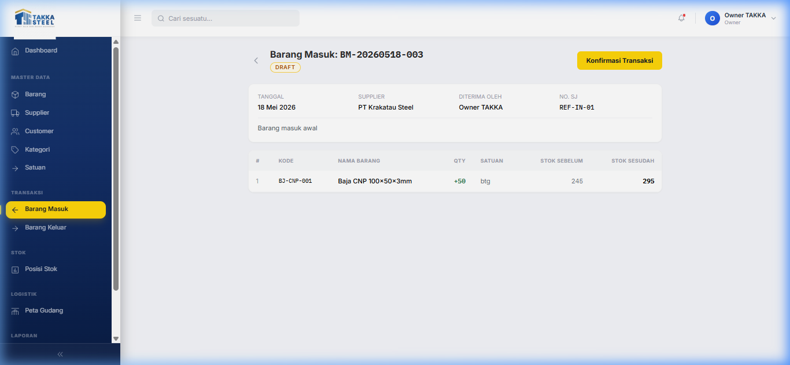 |

### 📦 Transaction Workflows (Stock Out)
| Stock Out List | Stock Out Form | Stock Out Detail |
|---|---|---|
| 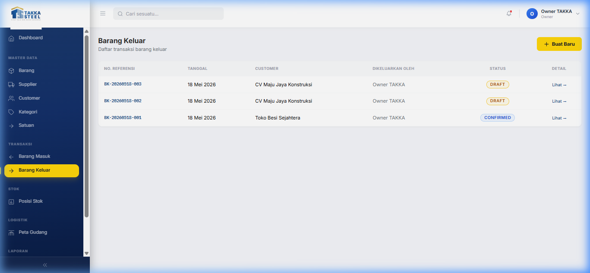 | 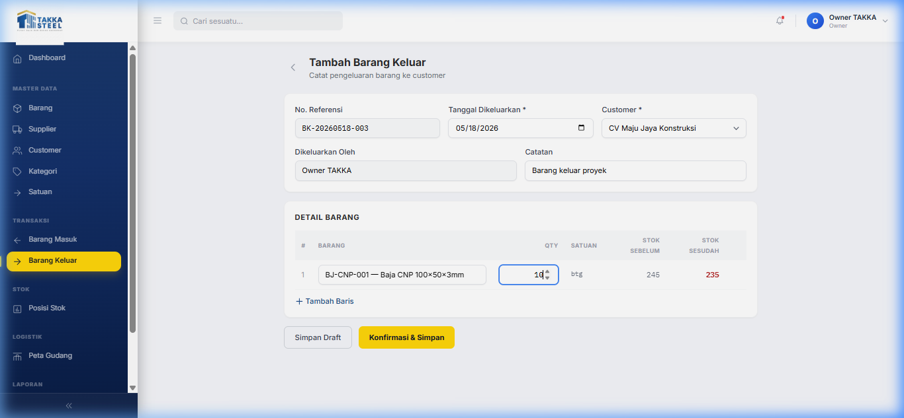 | 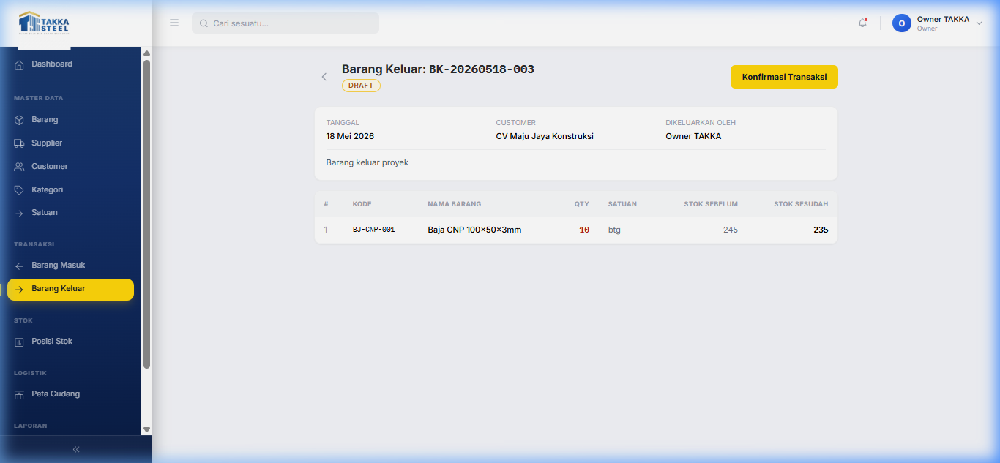 |

### 📍 Stock Position & History
| Stock Position | Stock History |
|---|---|
| 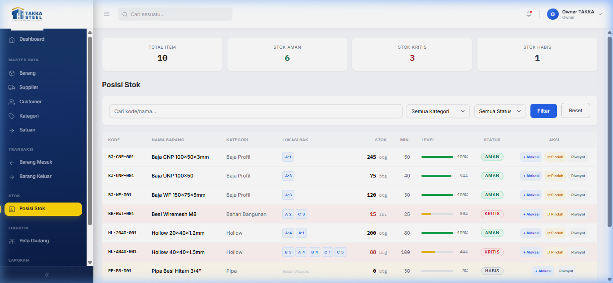 | 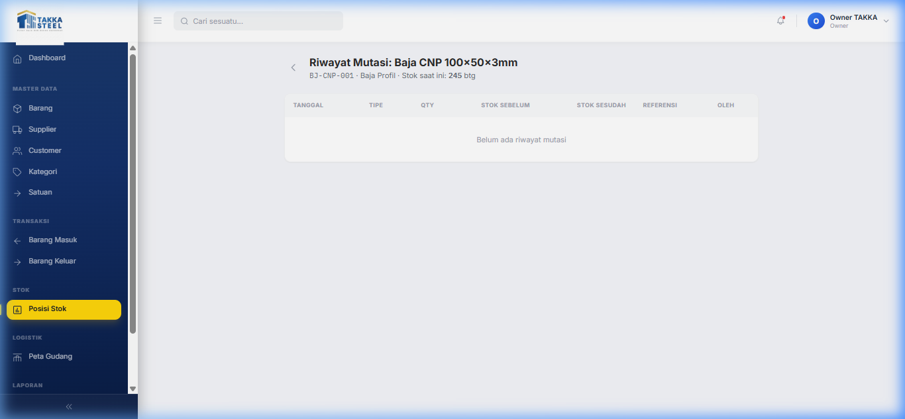 |

### 📈 Reports
| Stock Report | Stock In Report | Stock Out Report |
|---|---|---|
| 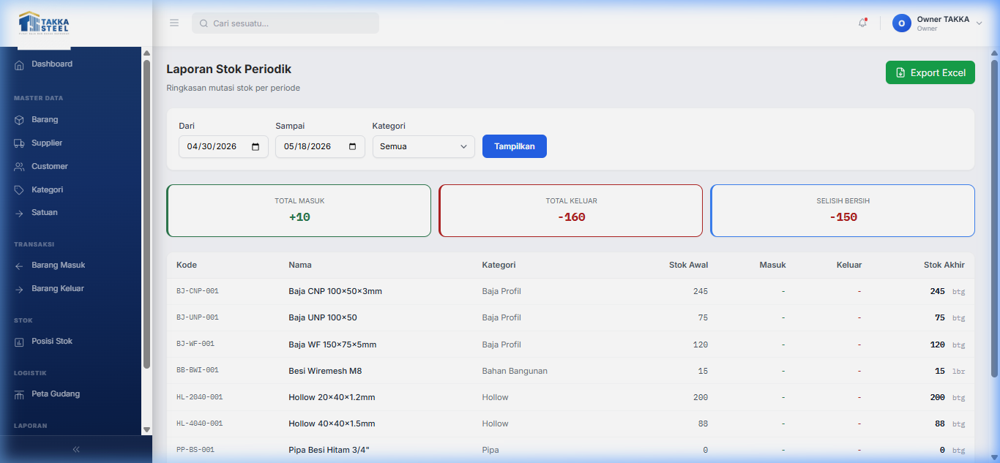 | 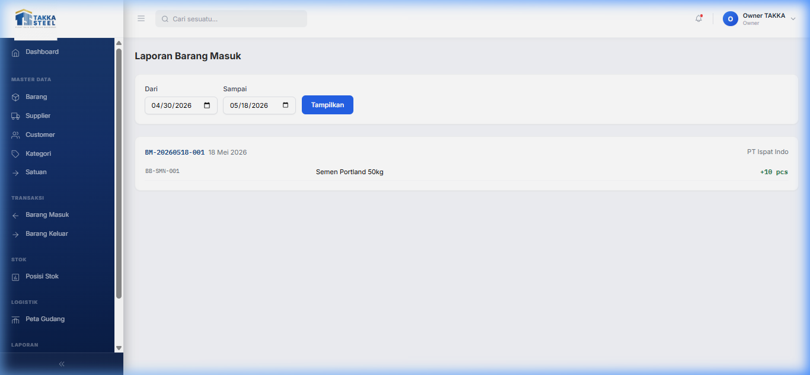 | 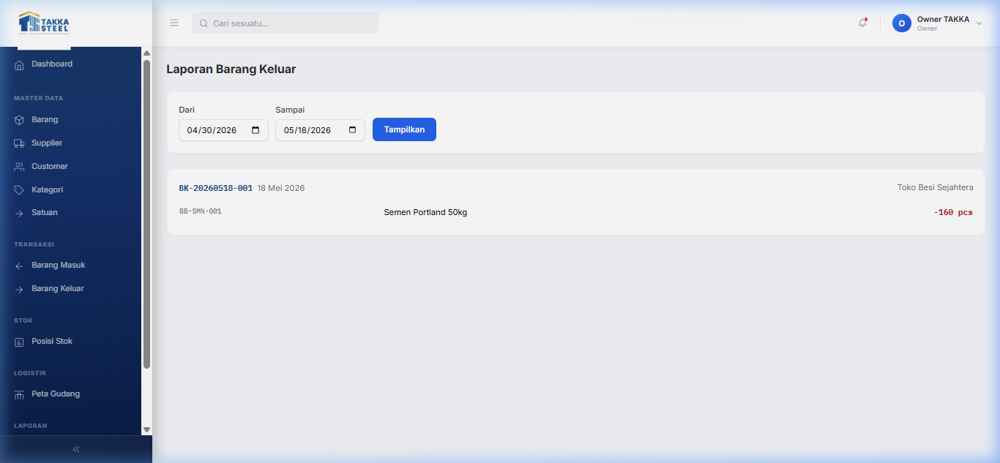 |

### 🏭 Warehouse & Settings
| Warehouse Layout | User Profile Settings | User Management |
|---|---|---|
| 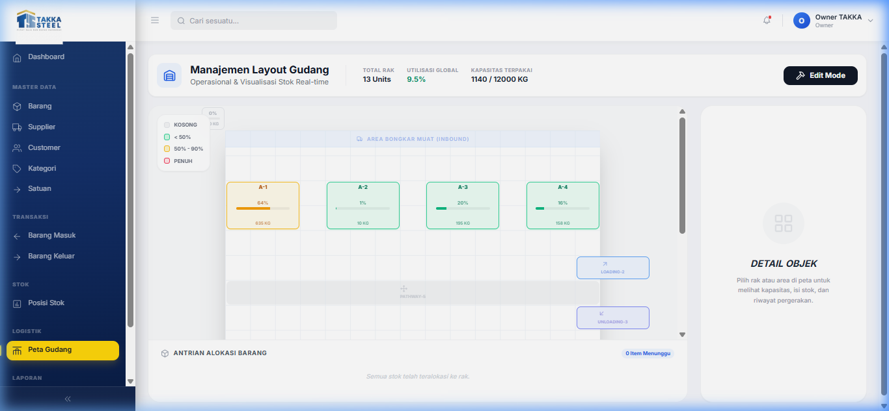 | 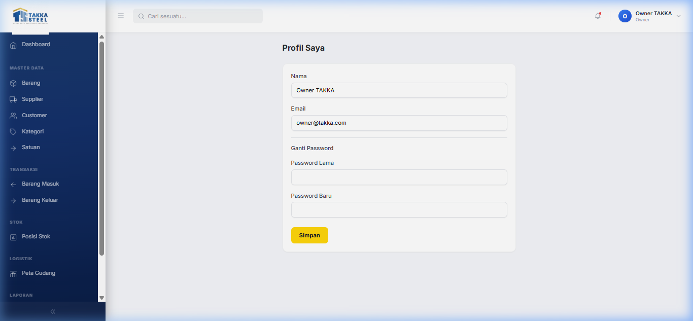 | 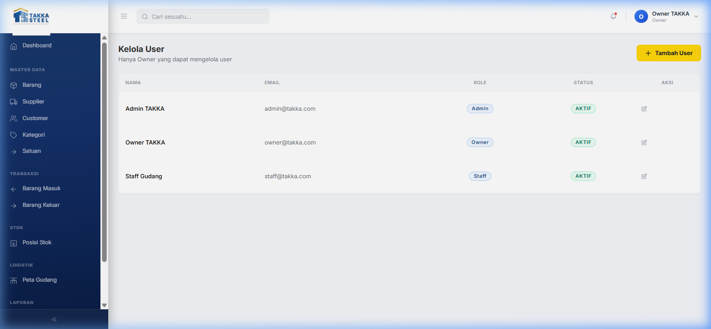 |

---

## 🛠️ Technology Stack

### Backend
| Technology | Purpose |
|---|---|
| **Node.js + Express.js** | REST API server |
| **PostgreSQL 16** | Relational database |
| **Sequelize 6** | ORM & schema management |
| **express-session** + **connect-session-sequelize** | Session-based authentication |
| **bcryptjs** | Password hashing |
| **express-validator** | Request validation |
| **exceljs** | Excel report generation |
| **multer** | File upload handling |
| **dayjs** | Date formatting |
| **EJS** | Server-rendered views (auth/session pages) |

### Frontend (`/client`)
| Technology | Purpose |
|---|---|
| **React 18** | UI component library |
| **Vite 5** | Build tool & dev server |
| **React Router v6** | Client-side routing |
| **Axios** | HTTP client (REST API calls) |
| **Tailwind CSS 3** | Utility-first styling |
| **lucide-react** | Icon library |
| **dayjs** | Date formatting |

### Infrastructure
| Technology | Purpose |
|---|---|
| **Docker + Docker Compose** | PostgreSQL containerization |
| **concurrently** | Runs backend + frontend in parallel |
| **nodemon** | Backend hot-reload in development |

---

## 🏗️ Architecture Overview

```
warehouse-management-system/
│
├── app.js                  # Express entry point & middleware setup
├── docker-compose.yml      # PostgreSQL container definition
│
├── controllers/            # HTTP handlers — parse request, call service, return response
├── services/               # Business logic layer
├── repositories/           # Data access layer (Sequelize queries)
├── models/                 # Sequelize schema & association definitions
├── routes/                 # Route definitions (API + legacy web routes)
│   ├── api_v1.js           # Main REST API router (v1)
│   ├── auth.js             # Authentication routes
│   ├── dashboard.js
│   ├── stock.js
│   ├── transaksi.js
│   ├── laporan.js
│   └── master.js
│
├── middleware/             # Auth guards, validation middleware
├── helpers/                # Utility & formatting helpers
├── seeders/                # Initial data population scripts
├── public/                 # Static assets served by Express
│
└── client/                 # React SPA (Vite)
    └── src/
        ├── App.jsx          # Root component & React Router config
        ├── main.jsx         # React entry point
        ├── pages/           # Page-level components (one per route)
        ├── components/      # Reusable UI components
        ├── layouts/         # MainLayout (sidebar + header shell)
        ├── contexts/        # React context (AuthContext)
        ├── hooks/           # Custom React hooks
        ├── services/        # Axios API service modules
        └── utils/           # Shared utility functions
```

**Data flow:** React SPA → Axios → Express REST API (`/api/v1/*`) → Services → Repositories → PostgreSQL

---

## ⚙️ Prerequisites

- [Node.js](https://nodejs.org/) **v18+**
- [npm](https://www.npmjs.com/) **v9+**
- [Docker Desktop](https://www.docker.com/products/docker-desktop/) (recommended, for the PostgreSQL database)
- *Or* a local [PostgreSQL](https://www.postgresql.org/) **v14+** installation

---

## 📦 Installation & Setup

### 1. Clone the Repository

```bash
git clone https://github.com/nflFauzan/warehouse-management-system.git
cd warehouse-management-system
```

### 2. Install Dependencies

This installs both backend and frontend (`/client`) dependencies in one step:

```bash
npm install
```

### 3. Environment Configuration

Create a `.env` file in the root directory. You can copy the example file:

```bash
cp .env.example .env
```

Then fill in the values:

```env
PORT=3000
SESSION_SECRET=your_secure_secret_key_here

# Database Configuration
DB_HOST=localhost
DB_PORT=5433          # 5433 when using Docker (mapped port); 5432 for a local Postgres instance
DB_NAME=wms_db
DB_USER=postgres
DB_PASSWORD=wms_takka
```

> **Note:** The Docker Compose file maps the container's PostgreSQL port `5432` to host port **`5433`** to avoid conflicts with any local PostgreSQL installation.

### 4. Start the Database (Docker)

```bash
docker-compose up -d
```

This starts a `postgres:16-alpine` container named `wms_postgres` with a persistent volume.

### 5. Initialize & Seed Data

Sync the database schema and populate initial seed data (admin user, etc.):

```bash
npm run seed
```

---

## ▶️ Running the Application

### Development Mode

Starts both the Express backend (with `nodemon`) and the Vite dev server concurrently:

```bash
npm run dev
```

| Service | URL |
|---|---|
| **React Frontend (Vite)** | `http://localhost:5173` |
| **Express Backend (API)** | `http://localhost:3000` |

> The Vite dev server is configured to proxy `/api` requests to the Express backend automatically.

### Production Mode

```bash
# Build the React SPA
cd client && npm run build && cd ..

# Start the Express server (serves API + built static files)
npm start
```

The application will be available at `http://localhost:3000`.

---

## 👤 Default Credentials

After running `npm run seed`, log in with the default admin account:

| Field | Value |
|---|---|
| Username | `admin` |
| Password | `admin123` |

> ⚠️ **Change the default password immediately** after first login in a production environment.

---

## 📄 API Overview

All REST endpoints are prefixed with `/api/v1/`. Authentication is session-based.

| Resource | Base Path |
|---|---|
| Auth | `/api/v1/auth` |
| Items | `/api/v1/items` |
| Categories | `/api/v1/categories` |
| Units | `/api/v1/units` |
| Suppliers | `/api/v1/suppliers` |
| Customers | `/api/v1/customers` |
| Stock In | `/api/v1/transaksi/masuk` |
| Stock Out | `/api/v1/transaksi/keluar` |
| Stock Position | `/api/v1/stock` |
| Warehouse Layout | `/api/v1/warehouse` |
| Reports | `/api/v1/laporan` |
| Users | `/api/v1/users` |

---

Built with ❤️ for **TAKKA STEEL**.